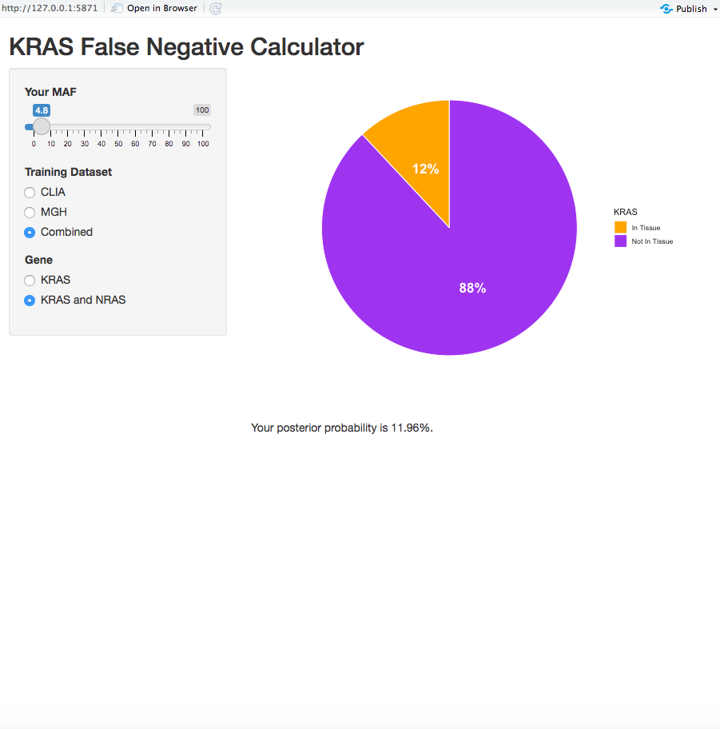

## About

The code in this repository is related to the in-progress manuscript "A novel clinical tool to estimate risk of false negative KRAS mutation in circulating tumor DNA testing" by Napolitano, Sun, et al.

Included is an R Shiny app that calculates the posterior probability of false negative KRAS mutation from ctDNA arrays. The code cannot be run without the reference data files, which we cannot provide for confidentiality reasons. If the data files are obtained with permission, they can be placed in the same directory as the R code, and then clicking "Run app" in R studio will launch the calculator.

We plan to soon host the app on a hospital server, which will any interested researchers to utilize the calculations without needing to access the raw data. An image of the running app is below.

