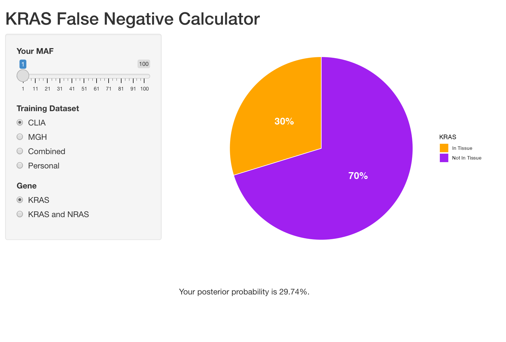

## About

The code in this repository is related to the submitted manuscript "A Novel Clinical Tool to Estimate Risk of False Negative KRAS Mutations in Circulating Tumor DNA Testing" by Napolitano et al.

Included is an R Shiny app that calculates the posterior probability of false negative KRAS mutation from ctDNA arrays. To run the app, you will need to open the code (the .R file) in RStudio. Then click "Run App" in RStudio.

If you want to use your own training dataset, you will need to take the additional step of putting the training data into a format that matches exampledat.csv, with columns for reference mutation frequency (maxAT column), KRAS mutation frequency, NRAS mutation frequency (just use all 0s if not interested in NRAS), tissue KRAS status (either TRUE or FALSE), and tissue NRAS status (just use all FALSE if not interested in NRAS). Please keep the column names exactly as they are in the example file, and do not place non-numeric data in the numeric columns. Separate all values by commas. Then change line 20 of the .R file to the location of the training data. Uncomment line 21 and comment line 22. Then run the app normally.

